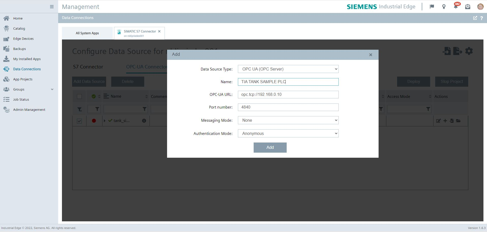
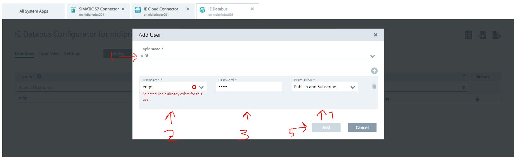

# Notifier Setup manual

- [Official documentation Notifier](https://github.com/industrial-edge/notifier-getting-started)
- [Official documentation Notifier External Comminications OpenApi](https://github.com/industrial-edge/notifier-api)

## Index
* [Overview](#overview)
  * [Setup](#setup)
* [Get Started](#get-started)
  * [Network](#network)
    * [OT Level](#ot-level)
    * [Plant Level](#plant-level)
  * [Apps](#apps)
    * [Simatic S7 Connector](#simatic-s7-connector)
    * [IE databus](#ie-databus)
    * [Flow Creator](#flow-creator)
    * [Notifier](#energy-manager)
   

## Overview

### Setup
- Plant level
  - Connected to PORT 2 on edge device.

- OT Level edge device
  - Uses Port 1 for PC connection
  - Uses Port 2 for PLC connection
  - Applications     
    - IE Databus - Is used as data channel - MQTT broker      
    - SIMATIC S7 Connector - used for data retrieve from plc
    - Notifier - Getting notifications
    - Flow Creator - Debugging of dataflow
      
- OT Level PLC
  - [Uses Tia Tank sample application](https://github.com/industrial-edge/miscellaneous#tank-application)

# Get started

## Network
  - PLANT-USER network 192.168.1.x/24 range
  - PLANT-OT network 192.168.0.x/24 range  
  - Devices:
    - PLC: 
      - 192.168.0.10
    - Edge Device: 
      - port 1: 192.168.1.10
      - port 2: 192.168.0.11
    - MYPC :
      - port: 192.168.1.11     

## OT Level
  Run Tia tank project on PLC SIM Advanced, or use a real PLC - Use a 1500 plc [Link Tia Portal Project](https://github.com/industrial-edge/miscellaneous#tank-application)  Or use your own project.  
  Give this PLC ip adress in range of the OT-South network, for example 192.168.0.10

## PLANT Level
Install the required apps on edge device
- Simatic s7 Connector 
- IE Databus 
- Notifier
- flow creator
- Dataservice
 
Setup the network settings  on edge device
  - Give the Edge-Device Port 2 ip adress in range of the OT-South network, for example 192.168.0.11
  - Give the Edge-Device Port 1 ip adress in range of the South-North network, for example 192.168.1.10

# Apps

## Simatic s7 Connector
1. Open the Industrial Edge Management - Go to Data Connections - Select the Simatic S7 connector

2. Launch on the Southbound device - select S7 or OPCUA (we use opcua) - add data Source 

3. Fill in the ip adress and port 192.168.0.10 port 4840 and save
4. Set the settings - use username: edge and password: edge, then press save.

5. A new row should be available in the list, press browse tags, all the tags should be read from the datasource. add all from the database GBD.

6. Deploy and start project, wait until done.

## IE Databus
1. Open the Industrial Edge Management - Go to Data Connections - Select the IE Databus
2. Launch on the Southbound device 
3. Add user + 

4. Topic: ie/#, username: edge, password: edge, permission: publish and subscribe, click on add.
5. Deploy, wait until its done

## Flow Creator
1. Open flow creator - on edge device, login with edge credentials 
2. Add mqtt in node
3. Add server: 
    - server: ie-databus
    - port: 1883
    - security - user: edge
    - security - password: edge
    - click on save
    - 
4. set topic:
    - ie/#
    - click on done.
5. Add message node and connect, then deploy.
6. check if data is flowing in debug window.

## Dataservice
1. Open the dataservice - on edge device.
2. Create a child asset in hierarchie for example "TankApplication".
3. We use this asset on notifier.
4. Add the variable "GDB.signals.energySignals.energyConsumptionFillingBottles" to the asset.

## Notifier
1. Open Notifier - on edge device.
2. Go to Settings > Manage Notification rules.
3. Create Notification rule. 
  - type: warning
  - Text: Energy consumption of filling bottles is too high
  - location : "TankApplication"
  - Tag: GDB.signals.energySignals.energyConsumptionFillingBottles

4. Save
5. wait, for alert to fire. if not, make sure your tia tank application is running with the HMI start button :)
